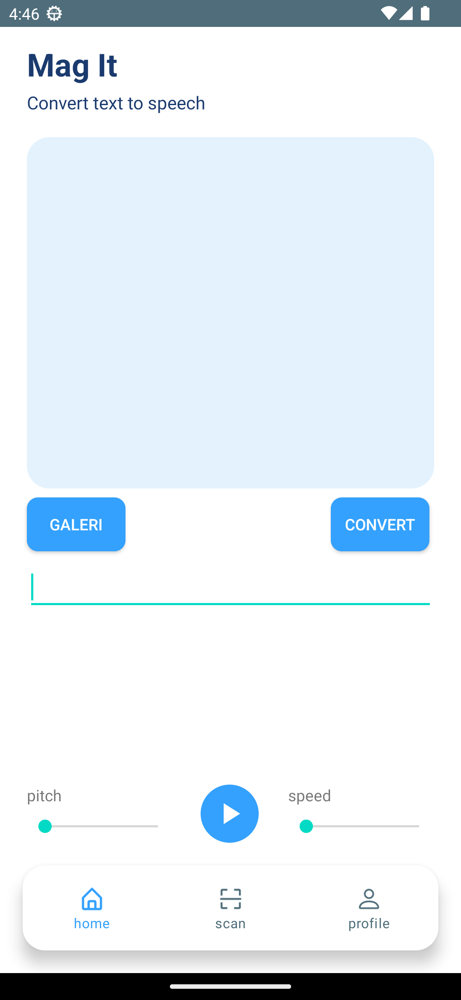

<<<<<<< HEAD
# Mobile-Development
=======
# Mag-it : Convert Text to Speech
A mobile application providing predicting the coordinates of all texts exist in an image and recognizing the value of all the texts detected by the text detection model 
by <a href="https://github.com/XSmas29/OCR-Flask">Machine Learning</a> that can be use for farsighted people in reading.

## Features
In this application you can:
* Detecting the word from the image that user upload
* Playing a sound from the word that have been detected 

## Getting Started
1.  Pull down the code locally
2.  Open Android Studio and select 'Open an existing Android Studio Project'
3.  Navigate to checked out repository
4.  Let the build gradle finished
5.  Run the application.

## Generating signed APK
From Android Studio:
1. ***Build*** menu
2. ***Generate Signed APK...***
3. Fill in the keystore information *(you only need to do this once manually and then let Android Studio remember it)*
>>>>>>> origin/main
